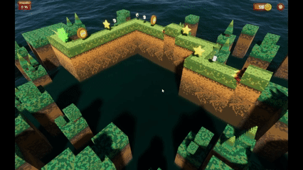

# 3D Project - VJ - UPC-FIB 2024/25 Q1

This project was developed as part of the **Video Games (VJ)** course at the **Faculty of Informatics of Barcelona (UPC-FIB)** during the **2024/25 Q1** term.  
The game is inspired by **Cliffy Jump**, implemented in **Unity**.

Authors:  
- **Alvar Dalda**  
- **Liliu Martínez**

📢 This project is for educational purposes only. Since it is inspired by an existing game, it will not be commercialized, and no economic profit will be obtained from it.
